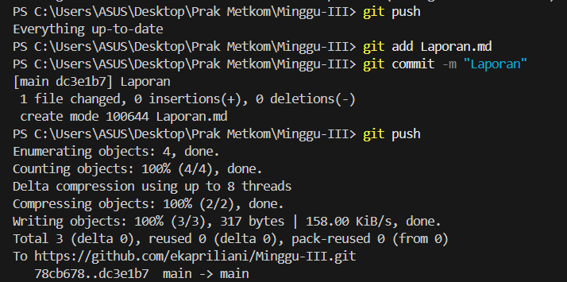

## ✅ Apa yang Saya Pelajari
- Cara membuat file **Markdown** dan menggunakan sintaks dasar seperti heading, list, link, dan gambar.  
- Bagaimana membuat **profile README** di GitHub agar orang lain tahu minat dan proyek saya.  
- Dasar-dasar menggunakan perintah Git seperti `clone`, `pull`, `push`, `commit`, dan `merge`.  

## ❓ Apa yang Masih Membingungkan
- Perbedaan penggunaan `fetch` dan `pull`.  
- Cara menyelesaikan konflik *merge* dengan lebih cepat.  
- Bagaimana membuat dokumentasi proyek yang lebih interaktif dengan badge dan tabel.  

---
## 📝 Laporan

### 1. Membuat File Markdown
Saya sudah membuat file ini (`Laporan.md`) sebagai laporan tugas.  

### 2. Membuat Profile README
Link ke profil README saya:  
👉 [Profil GitHub Saya](https://github.com/ekapriliani)  

### 3. Mencoba fitur-fitur (clone, pull/fetch/merge, push, commit, add)

# Terimakasih